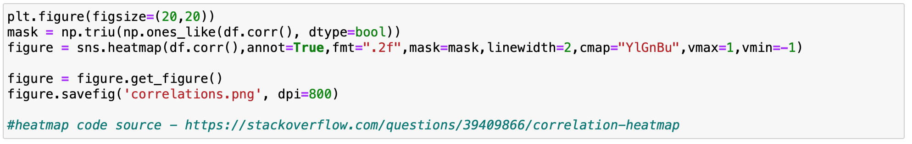
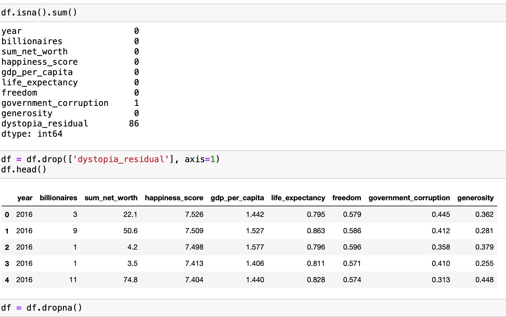
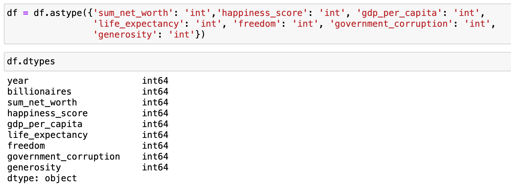
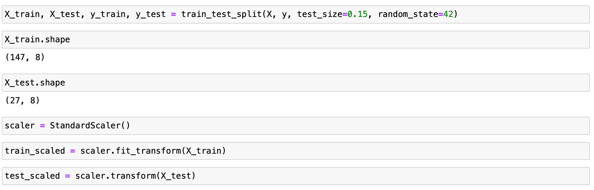
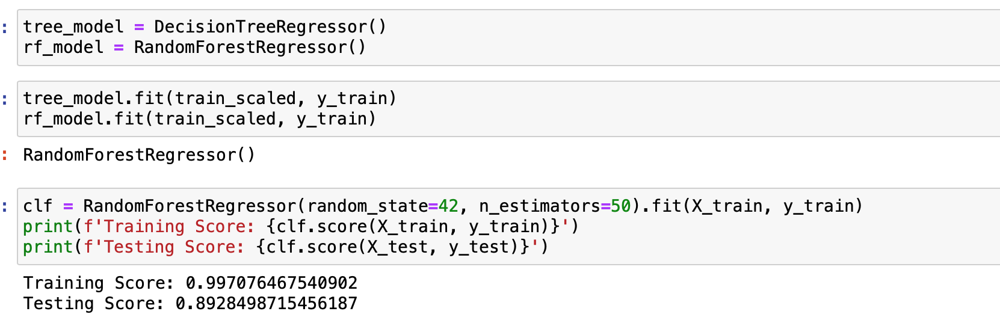

# final-project
## Segment 1
### Presentation Content:
[Link to Presentation Content](https://docs.google.com/presentation/d/1XPg9STbXekAmAopnO2dyry2ArxlAnhtrKhoGGwpg8ho/edit?usp=sharing)

### Communication Protocols:
#### Slack Channel with all three group members
#### Using class time to do majority of weekly work
#### Meeting through zoom if need be to collaborate

### Team Members:
#### daniethecreator - machine learning
#### stevenpy217 - database administration
#### ssyed21 - repository/data visualization

## Segment 2
### Project Outline
#### Step 1 - Project Formation
#### Step 2 - Data Collection
#### Step 3 - Data Filtering/Cleaning
#### Step 4 - Data Visualization
#### Step 5 - Machine Learning Integration
#### Step 6 - Analysis and Conclusion

### Visualization Dashboard Storyboard and Tool/Interactive Elements
#### [Link to Content](https://docs.google.com/presentation/d/1QEt-iPHj8puTHB0KhH6VZSqS7NMc-zfWgPadV98640k/edit?usp=sharing)
#### Visualization Tool: Tableau
#### Interactive Elements:
##### Slicers to choose filters based on location, number of billionaires, and/or GDP
##### Moveable Map for geographical data

## Segment 3
### Data Visualization
#### [Link to Tableau](https://public.tableau.com/app/profile/sohail.a.syed/viz/FinalProject_16245847247810/Story2)

#### Data Clean Up
* After deciding on the topic and the big question, we began the data clean up process. 
We consolidated the datasets from 2016~2021 for the 500 billionaire data and consolidated world happiness report with world happiness 2021 report.
Changed the column titles to all lowercase and replace spaces with underscore. 

#### SQL
* We uploaded the consolidated data into postgreSQL by creating table and importing data.
Once both tables and data have been imported we created a new table by merging the two dataset with the below query.
Primary key was set up on the reference (Year & Country) to be able to merge the two dataset.

#### Hosting on AWS

* Once we had the final dataset result1.csv we decided to host on AWS S3 bucket for online access. 
We created the AWS S3 bucket and changed the permission to public in order to connect from jupyter notebooks

### Machine Learning
#### [Link to Analysis Content](https://docs.google.com/presentation/d/1XPg9STbXekAmAopnO2dyry2ArxlAnhtrKhoGGwpg8ho/edit#slide=id.ge0e077afc1_0_44)
#### Determining the Features
* The first step we did was to see how the different columns correlated with each other since some of the first attempts resulted in negative accuracy scores. By creating a correlation visual we were able to see that the number of billionaires columns did not highly correlated with any of the happiness columns. This realization made us change strategies of the predictive model, instead of solely relying on happiness to predict billionaires, we knew we needed to keep the sum of net worth of the billionaires since the net amount of money billionaires make per country helps determine how many billionaires a country has. 

 

* The correlation also provided information on what factors were key drivers in determining the overall happiness score per country. Findings continue on the next page with the visualization, the code for the correlation graph including saving the graph image is below. 

#### Correlations
* In looking at the correlations between the different columns after the combination of the two datasets, we found that while gdp_per_capita has the highest correlation to the happiness score, the columns from the billionaires dataset, billionaires, rate, sum_of_net_worth had very low or no correlation to the different happiness columns including happiness score. We can conclude that money can buy happiness, but only to a certain point since the highest earned’ countries do not seem to impact their net worth or number of billionaires a country has. 
 

#### Description of preliminary data preprocessing 

* After looking at the columns, we noticed a few were strings, and we decided to set an index and then drop columns ‘reference’ and ‘country’ to remove any strings that could not be converted to integers.

* We then looked at the amount of NA values in each column and found that there were quite a few (14) countries that did not have ‘perceptions of corruption and so decided to drop that column from the dataset, especially since the most important column, ‘happiness score’ had no null values. For the other scores, we decided to drop na since there were only three rows that contained null values.
 

* Finally, we converted all the columns into integers in order to run the model and confirmed the data types. 

#### Data split into training and testing sets
* We set target column ‘billionaires’ to y and then dropped ‘billionaires’ in x before training it with 85% of the data and using 15% to test. Also, we used StandardScaler to fit and transform the training and testing data. 

#### Explanation of model choice, including limitations and benefits
* I chose Decision Trees and Random Forest unsupervised machine learning to be able to take in the different scores and factors of happiness to help aid the model to have more factors in determining how many billionaires each country will have. These two models used together are pretty straightforward to use without normalization while also being able to learn non-linear relationships, which is helpful for this set of data that has numeric values and calculated scores.
* Pros for Random Forest- predictive power, easy data prep, fast training, no normalization, can optimization options.
* Cons for Random Forest- Overfitting risk, variable bias
* Pros for Decision Trees - no normalization needed, deals well with missing values. Since all the different years didn’t always have the same columns, more straightforward and less preprocessing = less code, can learn non-linear relationships.
* Cons for Decision Trees - highly sensitive, takes longer, needs RF to work better for prediction.

### Conclusion 
#### Model Effectiveness 
* After keeping the sum of net happiness column, the model was able to work with over 85% testing score meaning that if we have the happiness data and the sum of net the top 500 billionaires by country, it has a pretty high chance of predicting how many top billionaires a country will have. 

* While this model does not include statistical testing, it would be interesting to see how happiness and the number of billionaires a country has have statistically significant change year over year to see if there are any patterns.
* Next steps- from the correlation and the predictive model, there are other factors outside of happiness that could determine the number of billionaires a country has. Looking for additional data sets including time spent in each country by billionaire, personal activities, lifestyle choices, main industries of countries, ect. could help more accurately determine the number of billionaires a country has without relying on sum of net worth. 

